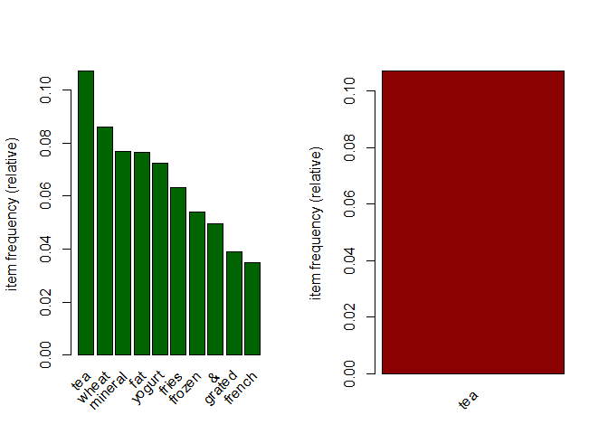

Part 3
================
Harrieth Rotich
6/4/2021

## Loading dependencies

``` r
library(arules)
```

    ## Loading required package: Matrix

    ## 
    ## Attaching package: 'arules'

    ## The following objects are masked from 'package:base':
    ## 
    ##     abbreviate, write

## Loading data

``` r
# Loading data
supermarket <- read.transactions('http://bit.ly/SupermarketDatasetII')
```

    ## Warning in asMethod(object): removing duplicated items in transactions

``` r
supermarket
```

    ## transactions in sparse format with
    ##  7501 transactions (rows) and
    ##  5729 items (columns)

``` r
class(supermarket)
```

    ## [1] "transactions"
    ## attr(,"package")
    ## [1] "arules"

``` r
inspect(supermarket[1:4])
```

    ##     items                              
    ## [1] {cheese,energy,                    
    ##      drink,tomato,                     
    ##      fat,                              
    ##      flour,yams,cottage,               
    ##      grapes,whole,                     
    ##      juice,frozen,                     
    ##      juice,low,                        
    ##      mix,green,                        
    ##      oil,                              
    ##      shrimp,almonds,avocado,vegetables,
    ##      smoothie,spinach,olive,           
    ##      tea,honey,salad,mineral,          
    ##      water,salmon,antioxydant,         
    ##      weat,                             
    ##      yogurt,green}                     
    ## [2] {burgers,meatballs,eggs}           
    ## [3] {chutney}                          
    ## [4] {turkey,avocado}

## Association Analysis

``` r
# Summary of the supermarket dataset

summary(supermarket)
```

    ## transactions as itemMatrix in sparse format with
    ##  7501 rows (elements/itemsets/transactions) and
    ##  5729 columns (items) and a density of 0.0005421748 
    ## 
    ## most frequent items:
    ##     tea   wheat mineral     fat  yogurt (Other) 
    ##     803     645     577     574     543   20157 
    ## 
    ## element (itemset/transaction) length distribution:
    ## sizes
    ##    1    2    3    4    5    6    7    8    9   10   11   12   13   15   16 
    ## 1603 2007 1382  942  651  407  228  151   70   39   13    5    1    1    1 
    ## 
    ##    Min. 1st Qu.  Median    Mean 3rd Qu.    Max. 
    ##   1.000   2.000   3.000   3.106   4.000  16.000 
    ## 
    ## includes extended item information - examples:
    ##                    labels
    ## 1                       &
    ## 2             accessories
    ## 3 accessories,antioxydant

``` r
# Frequency of some items

itemFrequency(supermarket[, 8:10],type = "absolute")
```

    ##     accessories,chocolate,frozen        accessories,chocolate,low 
    ##                                1                                1 
    ## accessories,chocolate,pasta,salt 
    ##                                1

``` r
round(itemFrequency(supermarket[, 8:10],type = "relative")*100,2)
```

    ##     accessories,chocolate,frozen        accessories,chocolate,low 
    ##                             0.01                             0.01 
    ## accessories,chocolate,pasta,salt 
    ##                             0.01

``` r
# Producing a chart of frequencies and fitering 
# Displaying top 10 most common items 
# and the items whose importance is at least 10%

par(mfrow = c(1, 2))

# plot the frequency of items
itemFrequencyPlot(supermarket, topN = 10,col="darkgreen")
itemFrequencyPlot(supermarket, support = 0.1,col="darkred")
```

<!-- -->
Tea has the most support in the transactions done above. The graph above
shows the top most items having the most support.

``` r
# Building a model based on association rules using the apriori function 

rules <- apriori (supermarket, parameter = list(supp = 0.001, conf = 0.8))
```

    ## Apriori
    ## 
    ## Parameter specification:
    ##  confidence minval smax arem  aval originalSupport maxtime support minlen
    ##         0.8    0.1    1 none FALSE            TRUE       5   0.001      1
    ##  maxlen target  ext
    ##      10  rules TRUE
    ## 
    ## Algorithmic control:
    ##  filter tree heap memopt load sort verbose
    ##     0.1 TRUE TRUE  FALSE TRUE    2    TRUE
    ## 
    ## Absolute minimum support count: 7 
    ## 
    ## set item appearances ...[0 item(s)] done [0.00s].
    ## set transactions ...[5729 item(s), 7501 transaction(s)] done [0.02s].
    ## sorting and recoding items ... [354 item(s)] done [0.00s].
    ## creating transaction tree ... done [0.00s].
    ## checking subsets of size 1 2 3 4 done [0.00s].
    ## writing ... [271 rule(s)] done [0.00s].
    ## creating S4 object  ... done [0.00s].

``` r
rules
```

    ## set of 271 rules

``` r
# Exploring model

summary(rules)
```

    ## set of 271 rules
    ## 
    ## rule length distribution (lhs + rhs):sizes
    ##   2   3   4 
    ## 107 144  20 
    ## 
    ##    Min. 1st Qu.  Median    Mean 3rd Qu.    Max. 
    ##   2.000   2.000   3.000   2.679   3.000   4.000 
    ## 
    ## summary of quality measures:
    ##     support           confidence       coverage             lift        
    ##  Min.   :0.001067   Min.   :0.800   Min.   :0.001067   Min.   :  7.611  
    ##  1st Qu.:0.001200   1st Qu.:0.931   1st Qu.:0.001200   1st Qu.: 11.630  
    ##  Median :0.001600   Median :1.000   Median :0.001600   Median : 13.068  
    ##  Mean   :0.002834   Mean   :0.963   Mean   :0.002973   Mean   : 22.372  
    ##  3rd Qu.:0.002666   3rd Qu.:1.000   3rd Qu.:0.002800   3rd Qu.: 20.218  
    ##  Max.   :0.068391   Max.   :1.000   Max.   :0.076523   Max.   :613.718  
    ##      count       
    ##  Min.   :  8.00  
    ##  1st Qu.:  9.00  
    ##  Median : 12.00  
    ##  Mean   : 21.26  
    ##  3rd Qu.: 20.00  
    ##  Max.   :513.00  
    ## 
    ## mining info:
    ##         data ntransactions support confidence
    ##  supermarket          7501   0.001        0.8

Most rules have 3 and 2 items

``` r
# Inspecting the first five rules made

inspect(rules[1:5])
```

    ##     lhs                                rhs      support     confidence
    ## [1] {cookies,low}                   => {yogurt} 0.001066524 1         
    ## [2] {cookies,low}                   => {fat}    0.001066524 1         
    ## [3] {extra}                         => {dark}   0.001066524 1         
    ## [4] {burgers,whole}                 => {wheat}  0.001199840 1         
    ## [5] {fries,escalope,pasta,mushroom} => {cream}  0.001066524 1         
    ##     coverage    lift     count
    ## [1] 0.001066524 13.81400 8    
    ## [2] 0.001066524 13.06794 8    
    ## [3] 0.001066524 83.34444 8    
    ## [4] 0.001199840 11.62946 9    
    ## [5] 0.001066524 47.77707 8

When someone buys cookies, they are 100% likely to buy yogurt. Just
like, when one buys fries, escalope, pasta and mushroom they are 100%
likely to buy cream.

``` r
# Ordering the rules by confidence level criteria
rul <-sort(rules, by="confidence", decreasing=FALSE)
inspect(rul[1:5]) 
```

    ##     lhs                 rhs      support     confidence coverage    lift     
    ## [1] {tomatoes,whole} => {wheat}  0.001066524 0.8        0.001333156  9.303566
    ## [2] {dogs,low}       => {yogurt} 0.001066524 0.8        0.001333156 11.051197
    ## [3] {bar,low}        => {yogurt} 0.001599787 0.8        0.001999733 11.051197
    ## [4] {dogs,low,fat}   => {yogurt} 0.001066524 0.8        0.001333156 11.051197
    ## [5] {bar,low,fat}    => {yogurt} 0.001599787 0.8        0.001999733 11.051197
    ##     count
    ## [1]  8   
    ## [2]  8   
    ## [3] 12   
    ## [4]  8   
    ## [5] 12

When someone buys tomatoes, they 80% likely to buy wheat.
