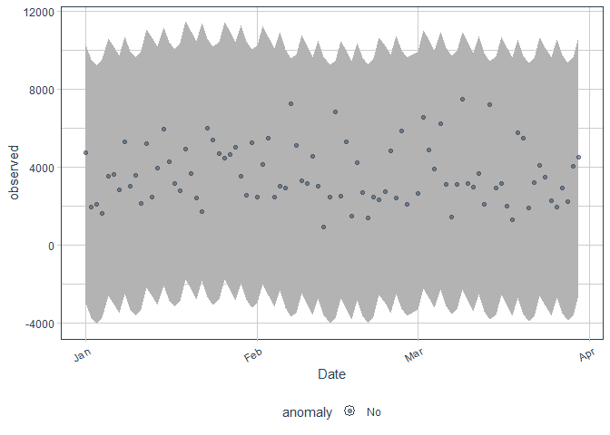
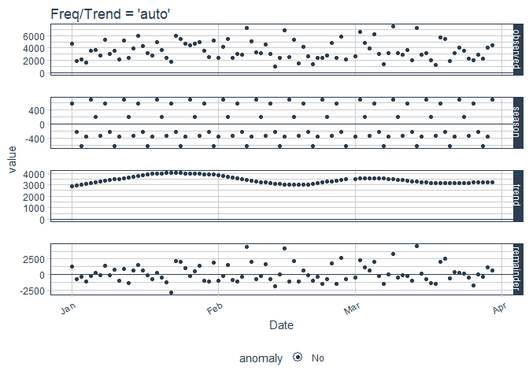
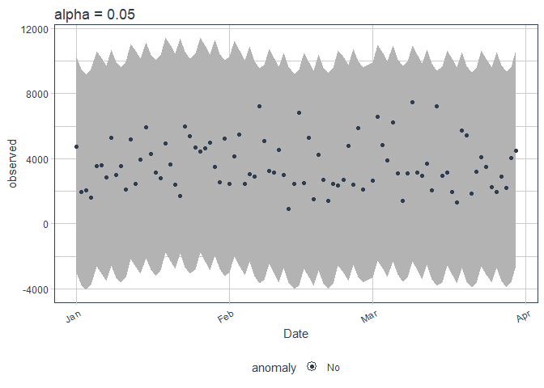

Part 4
================
Harrieth Rotich
6/4/2021

## Loading dependencies

``` r
library(tidyverse)
```

    ## -- Attaching packages -------------------------------------------------------------------------- tidyverse 1.3.0 --

    ## v ggplot2 3.3.2     v purrr   0.3.4
    ## v tibble  3.0.2     v dplyr   1.0.0
    ## v tidyr   1.1.0     v stringr 1.4.0
    ## v readr   1.3.1     v forcats 0.5.0

    ## -- Conflicts ----------------------------------------------------------------------------- tidyverse_conflicts() --
    ## x dplyr::filter() masks stats::filter()
    ## x dplyr::lag()    masks stats::lag()

``` r
library(anomalize) 
```

    ## == Use anomalize to improve your Forecasts by 50%! ================================================================
    ## Business Science offers a 1-hour course - Lab #18: Time Series Anomaly Detection!
    ## </> Learn more at: https://university.business-science.io/p/learning-labs-pro </>

``` r
library(dplyr)
library(tibble)
```

## Loading data

``` r
 # Loading data
sales <- read.csv('http://bit.ly/CarreFourSalesDataset')
head(sales) 
```

    ##        Date    Sales
    ## 1  1/5/2019 548.9715
    ## 2  3/8/2019  80.2200
    ## 3  3/3/2019 340.5255
    ## 4 1/27/2019 489.0480
    ## 5  2/8/2019 634.3785
    ## 6 3/25/2019 627.6165

``` r
# Transforming date column into Date type
sales$Date <- as.Date(sales$Date,format = "%m/%d/%y")
```

``` r
# Aggregating column by sum
sale <- aggregate(sales[,-1], list(Date =sales[,1]), FUN = sum)
```

``` r
# Information about the dataset
 str(sale)
```

    ## 'data.frame':    89 obs. of  2 variables:
    ##  $ Date: Date, format: "2020-01-01" "2020-01-02" ...
    ##  $ x   : num  4745 1946 2078 1624 3537 ...

``` r
# Converting dataframe into tibble
sale_df <- as_tibble(sale) 
```

``` r
# Updated information about the tibble
 str(sale_df)
```

    ## tibble [89 x 2] (S3: tbl_df/tbl/data.frame)
    ##  $ Date: Date[1:89], format: "2020-01-01" "2020-01-02" ...
    ##  $ x   : num [1:89] 4745 1946 2078 1624 3537 ...

``` r
# Performing the anomaly detection

 sale_df %>%
    time_decompose(x) %>%
    anomalize(remainder) %>%
    time_recompose() %>%
    plot_anomalies(time_recomposed = TRUE, ncol = 3, alpha_dots = 0.5)
```

    ## Converting from tbl_df to tbl_time.
    ## Auto-index message: index = Date

    ## frequency = 7 days

    ## trend = 30 days

    ## Registered S3 method overwritten by 'quantmod':
    ##   method            from
    ##   as.zoo.data.frame zoo

<!-- -->

``` r
# Anomaly detection
sale_df %>%
    time_decompose(x) %>%
    anomalize(remainder) %>%
    time_recompose() %>%
    plot_anomalies(time_recomposed = TRUE, ncol = 3, alpha_dots = 0.5) 
```

    ## Converting from tbl_df to tbl_time.
    ## Auto-index message: index = Date

    ## frequency = 7 days

    ## trend = 30 days

<!-- -->

``` r
anomalized <- sale_df %>% 
    time_decompose(x) %>%
    anomalize(remainder) %>%
    time_recompose()
```

    ## Converting from tbl_df to tbl_time.
    ## Auto-index message: index = Date

    ## frequency = 7 days

    ## trend = 30 days

``` r
anomalized %>% glimpse()
```

    ## Rows: 89
    ## Columns: 10
    ## $ Date          <date> 2020-01-01, 2020-01-02, 2020-01-03, 2020-01-04, 2020...
    ## $ observed      <dbl> 4745.181, 1945.503, 2078.128, 1623.688, 3536.684, 361...
    ## $ season        <dbl> 595.6079, -215.6459, -610.3359, -351.4537, 696.4782, ...
    ## $ trend         <dbl> 2885.719, 2951.906, 3018.092, 3084.279, 3147.297, 321...
    ## $ remainder     <dbl> 1263.8544, -790.7567, -329.6281, -1109.1372, -307.091...
    ## $ remainder_l1  <dbl> -6462.091, -6462.091, -6462.091, -6462.091, -6462.091...
    ## $ remainder_l2  <dbl> 6771.022, 6771.022, 6771.022, 6771.022, 6771.022, 677...
    ## $ anomaly       <chr> "No", "No", "No", "No", "No", "No", "No", "No", "No",...
    ## $ recomposed_l1 <dbl> -2980.764, -3725.831, -4054.334, -3729.265, -2618.316...
    ## $ recomposed_l2 <dbl> 10252.349, 9507.282, 9178.779, 9503.848, 10614.797, 1...

``` r
# Visualising frequency and trend decomposition
p1 <- anomalized %>%
    plot_anomaly_decomposition() +
    ggtitle("Freq/Trend = 'auto'") 

p1
```

<!-- -->

``` r
# determine logical frequency and trend spans

get_time_scale_template()
```

    ## Warning: `...` is not empty.
    ## 
    ## We detected these problematic arguments:
    ## * `needs_dots`
    ## 
    ## These dots only exist to allow future extensions and should be empty.
    ## Did you misspecify an argument?

    ## # A tibble: 8 x 3
    ##   time_scale frequency trend   
    ##   <chr>      <chr>     <chr>   
    ## 1 second     1 hour    12 hours
    ## 2 minute     1 day     14 days 
    ## 3 hour       1 day     1 month 
    ## 4 day        1 week    3 months
    ## 5 week       1 quarter 1 year  
    ## 6 month      1 year    5 years 
    ## 7 quarter    1 year    10 years
    ## 8 year       5 years   30 years

If the scale is one day, then the frequency is 7 days and the trend is 3
months or 90 days.

``` r
# Adjusting the anomaly detection

p4 <- sale_df %>%
    time_decompose(x) %>%
    anomalize(remainder, alpha = 0.05, max_anoms = 0.2) %>%
    time_recompose() %>%
    plot_anomalies(time_recomposed = TRUE) +
    ggtitle("alpha = 0.05")
```

    ## Converting from tbl_df to tbl_time.
    ## Auto-index message: index = Date

    ## frequency = 7 days

    ## trend = 30 days

``` r
p4
```

<!-- -->
