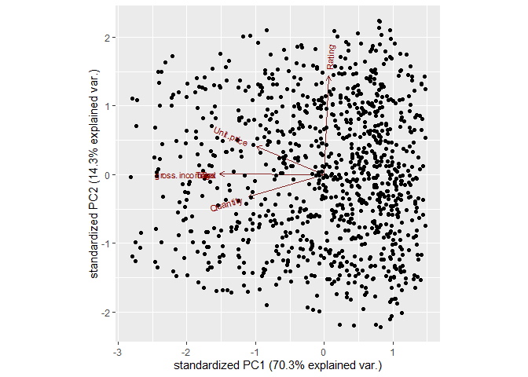
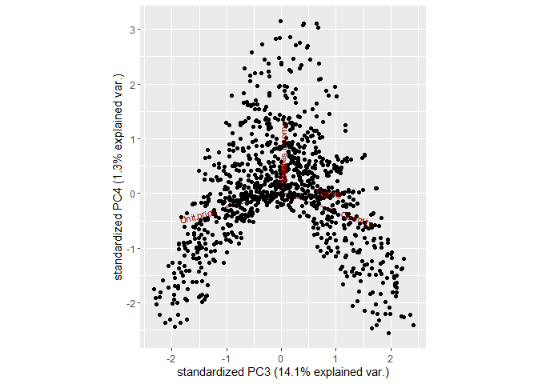
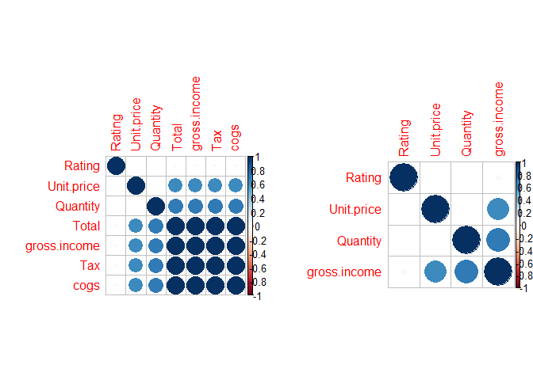

Part I
================
Harrieth Rotich
6/4/2021

## Loading dependencies

``` r
library(devtools)
```

    ## Loading required package: usethis

``` r
library(ggbiplot)
```

    ## Loading required package: ggplot2

    ## Loading required package: plyr

    ## Loading required package: scales

    ## Loading required package: grid

# Part I

## Loading data

``` r
# Loading data
carr <- read.csv('http://bit.ly/CarreFourDataset')
head(carr)
```

    ##    Invoice.ID Branch Customer.type Gender           Product.line Unit.price
    ## 1 750-67-8428      A        Member Female      Health and beauty      74.69
    ## 2 226-31-3081      C        Normal Female Electronic accessories      15.28
    ## 3 631-41-3108      A        Normal   Male     Home and lifestyle      46.33
    ## 4 123-19-1176      A        Member   Male      Health and beauty      58.22
    ## 5 373-73-7910      A        Normal   Male      Sports and travel      86.31
    ## 6 699-14-3026      C        Normal   Male Electronic accessories      85.39
    ##   Quantity     Tax      Date  Time     Payment   cogs gross.margin.percentage
    ## 1        7 26.1415  1/5/2019 13:08     Ewallet 522.83                4.761905
    ## 2        5  3.8200  3/8/2019 10:29        Cash  76.40                4.761905
    ## 3        7 16.2155  3/3/2019 13:23 Credit card 324.31                4.761905
    ## 4        8 23.2880 1/27/2019 20:33     Ewallet 465.76                4.761905
    ## 5        7 30.2085  2/8/2019 10:37     Ewallet 604.17                4.761905
    ## 6        7 29.8865 3/25/2019 18:30     Ewallet 597.73                4.761905
    ##   gross.income Rating    Total
    ## 1      26.1415    9.1 548.9715
    ## 2       3.8200    9.6  80.2200
    ## 3      16.2155    7.4 340.5255
    ## 4      23.2880    8.4 489.0480
    ## 5      30.2085    5.3 634.3785
    ## 6      29.8865    4.1 627.6165

``` r
# Info about the dataset
str(carr)
```

    ## 'data.frame':    1000 obs. of  16 variables:
    ##  $ Invoice.ID             : chr  "750-67-8428" "226-31-3081" "631-41-3108" "123-19-1176" ...
    ##  $ Branch                 : chr  "A" "C" "A" "A" ...
    ##  $ Customer.type          : chr  "Member" "Normal" "Normal" "Member" ...
    ##  $ Gender                 : chr  "Female" "Female" "Male" "Male" ...
    ##  $ Product.line           : chr  "Health and beauty" "Electronic accessories" "Home and lifestyle" "Health and beauty" ...
    ##  $ Unit.price             : num  74.7 15.3 46.3 58.2 86.3 ...
    ##  $ Quantity               : int  7 5 7 8 7 7 6 10 2 3 ...
    ##  $ Tax                    : num  26.14 3.82 16.22 23.29 30.21 ...
    ##  $ Date                   : chr  "1/5/2019" "3/8/2019" "3/3/2019" "1/27/2019" ...
    ##  $ Time                   : chr  "13:08" "10:29" "13:23" "20:33" ...
    ##  $ Payment                : chr  "Ewallet" "Cash" "Credit card" "Ewallet" ...
    ##  $ cogs                   : num  522.8 76.4 324.3 465.8 604.2 ...
    ##  $ gross.margin.percentage: num  4.76 4.76 4.76 4.76 4.76 ...
    ##  $ gross.income           : num  26.14 3.82 16.22 23.29 30.21 ...
    ##  $ Rating                 : num  9.1 9.6 7.4 8.4 5.3 4.1 5.8 8 7.2 5.9 ...
    ##  $ Total                  : num  549 80.2 340.5 489 634.4 ...

## Dimensionality Reduction

``` r
# Selecting numerical data
df <- carr[, c(6, 7, 8, 12, 14:16)]
head(df)
```

    ##   Unit.price Quantity     Tax   cogs gross.income Rating    Total
    ## 1      74.69        7 26.1415 522.83      26.1415    9.1 548.9715
    ## 2      15.28        5  3.8200  76.40       3.8200    9.6  80.2200
    ## 3      46.33        7 16.2155 324.31      16.2155    7.4 340.5255
    ## 4      58.22        8 23.2880 465.76      23.2880    8.4 489.0480
    ## 5      86.31        7 30.2085 604.17      30.2085    5.3 634.3785
    ## 6      85.39        7 29.8865 597.73      29.8865    4.1 627.6165

``` r
# Perform PCA
pca.df <- prcomp(carr[, c(6, 7, 8, 12, 14:16)], center = TRUE, scale. = TRUE)
summary(pca.df)
```

    ## Importance of components:
    ##                           PC1    PC2    PC3     PC4       PC5       PC6
    ## Standard deviation     2.2185 1.0002 0.9939 0.30001 1.499e-16 1.095e-16
    ## Proportion of Variance 0.7031 0.1429 0.1411 0.01286 0.000e+00 0.000e+00
    ## Cumulative Proportion  0.7031 0.8460 0.9871 1.00000 1.000e+00 1.000e+00
    ##                              PC7
    ## Standard deviation     1.298e-17
    ## Proportion of Variance 0.000e+00
    ## Cumulative Proportion  1.000e+00

The first principle component accounts for 70% of the total variance.
This shows that most of the information in the dataset is captured in
the first principle component.

``` r
# Looking at pca object
str(pca.df)
```

    ## List of 5
    ##  $ sdev    : num [1:7] 2.22 1.00 9.94e-01 3.00e-01 1.50e-16 ...
    ##  $ rotation: num [1:7, 1:7] -0.292 -0.325 -0.45 -0.45 -0.45 ...
    ##   ..- attr(*, "dimnames")=List of 2
    ##   .. ..$ : chr [1:7] "Unit.price" "Quantity" "Tax" "cogs" ...
    ##   .. ..$ : chr [1:7] "PC1" "PC2" "PC3" "PC4" ...
    ##  $ center  : Named num [1:7] 55.67 5.51 15.38 307.59 15.38 ...
    ##   ..- attr(*, "names")= chr [1:7] "Unit.price" "Quantity" "Tax" "cogs" ...
    ##  $ scale   : Named num [1:7] 26.49 2.92 11.71 234.18 11.71 ...
    ##   ..- attr(*, "names")= chr [1:7] "Unit.price" "Quantity" "Tax" "cogs" ...
    ##  $ x       : num [1:1000, 1:7] -2.005 2.306 -0.186 -1.504 -2.8 ...
    ##   ..- attr(*, "dimnames")=List of 2
    ##   .. ..$ : NULL
    ##   .. ..$ : chr [1:7] "PC1" "PC2" "PC3" "PC4" ...
    ##  - attr(*, "class")= chr "prcomp"

``` r
# Plotting the first two principal components
ggbiplot(pca.df)
```

<!-- -->

Rating, Unit price and quantity are the most significant variables, they
account for most of the percentage variance.

``` r
# Plotting the third and fourth principal components
ggbiplot(pca.df, ellipse=TRUE,choices=c(3,4))
```

<!-- --> By
plotting the third and fourth principal components, we see that they
don’t contribute much to the dataset.

# Part II

## Loading dependencies

``` r
library(caret) 
```

    ## Loading required package: lattice

``` r
library(corrplot)
```

    ## corrplot 0.84 loaded

## Loading data

``` r
# Loading data
carr <- read.csv('http://bit.ly/CarreFourDataset')
head(carr) 
```

    ##    Invoice.ID Branch Customer.type Gender           Product.line Unit.price
    ## 1 750-67-8428      A        Member Female      Health and beauty      74.69
    ## 2 226-31-3081      C        Normal Female Electronic accessories      15.28
    ## 3 631-41-3108      A        Normal   Male     Home and lifestyle      46.33
    ## 4 123-19-1176      A        Member   Male      Health and beauty      58.22
    ## 5 373-73-7910      A        Normal   Male      Sports and travel      86.31
    ## 6 699-14-3026      C        Normal   Male Electronic accessories      85.39
    ##   Quantity     Tax      Date  Time     Payment   cogs gross.margin.percentage
    ## 1        7 26.1415  1/5/2019 13:08     Ewallet 522.83                4.761905
    ## 2        5  3.8200  3/8/2019 10:29        Cash  76.40                4.761905
    ## 3        7 16.2155  3/3/2019 13:23 Credit card 324.31                4.761905
    ## 4        8 23.2880 1/27/2019 20:33     Ewallet 465.76                4.761905
    ## 5        7 30.2085  2/8/2019 10:37     Ewallet 604.17                4.761905
    ## 6        7 29.8865 3/25/2019 18:30     Ewallet 597.73                4.761905
    ##   gross.income Rating    Total
    ## 1      26.1415    9.1 548.9715
    ## 2       3.8200    9.6  80.2200
    ## 3      16.2155    7.4 340.5255
    ## 4      23.2880    8.4 489.0480
    ## 5      30.2085    5.3 634.3785
    ## 6      29.8865    4.1 627.6165

## Feature Selection

\#\#\#by filtering

``` r
# Numerical data by filtering
df <- carr[, c(6, 7, 8, 12, 14:16)]
head(df)
```

    ##   Unit.price Quantity     Tax   cogs gross.income Rating    Total
    ## 1      74.69        7 26.1415 522.83      26.1415    9.1 548.9715
    ## 2      15.28        5  3.8200  76.40       3.8200    9.6  80.2200
    ## 3      46.33        7 16.2155 324.31      16.2155    7.4 340.5255
    ## 4      58.22        8 23.2880 465.76      23.2880    8.4 489.0480
    ## 5      86.31        7 30.2085 604.17      30.2085    5.3 634.3785
    ## 6      85.39        7 29.8865 597.73      29.8865    4.1 627.6165

``` r
# Calculating the correlation matrix

correlationMatrix <- cor(df)
```

``` r
# Determining highly correlated variables
highlyCorrelated <- findCorrelation(correlationMatrix, cutoff=0.75)
highlyCorrelated
```

    ## [1] 4 7 3

``` r
# Highly correlated attributes names
names(df[,highlyCorrelated])
```

    ## [1] "cogs"  "Total" "Tax"

``` r
# Removing highly correlated attributes

corr.df<-df[-highlyCorrelated]
```

``` r
# Showing the difference made after feature selection
par(mfrow = c(1, 2))
corrplot(correlationMatrix, order = "hclust")
corrplot(cor(corr.df), order = "hclust") 
```

<!-- -->

Removing the highly correlated variables leaves the features that are
the most useful in training.
